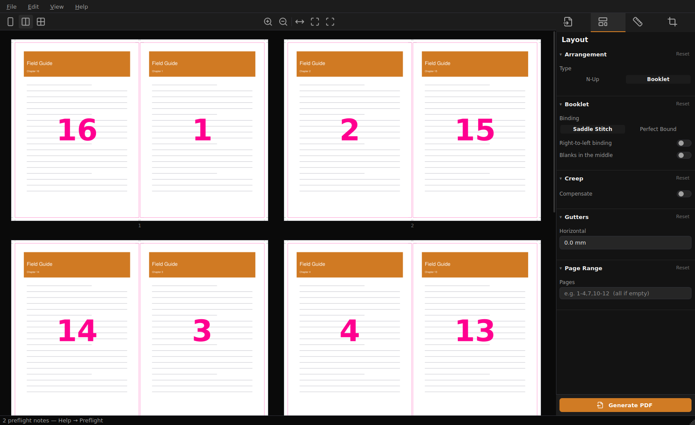

# PressReady — put your pages on the press sheet

**PressReady lays PDF pages out on printing sheets.** Give it a document, tell it what you're
printing on, and it arranges the pages so they come out right after they're printed, folded and
cut. Two-up on A3, a saddle-stitched booklet, a sheet of labels — that job.

It's free, open source, and runs on your own machine. Nothing is uploaded anywhere.

[](https://www.gnu.org/licenses/agpl-3.0)
[](#install)
[](https://github.com/danielmevit/pressready/releases)



- **Your pages stay sharp.** Pages are embedded as vectors, never turned into pictures. What
  comes out is exactly as crisp as what went in.
- **It reads print files properly.** If your PDF has a trim box and bleed — the way a
  print-ready export does — PressReady uses them. Ordinary PDFs work fine too.
- **The preview is the real thing.** The sheets on screen are rendered from an actual
  imposition, and the pink outlines are the cut lines that run used. It can't show you one thing
  and print another.
- **It tells you before the press does.** Margins that don't fit, a missing trim box, pages
  getting shrunk — you hear about it while you can still fix it.

## Install

**Windows** — easiest is the portable `.zip` from
[Releases](https://github.com/danielmevit/pressready/releases): unzip, run `PressReady.exe`
(SmartScreen warns once — **More info → Run anyway**). Prefer a proper install? The `.msix` is
signed with the project's own certificate, so Windows asks you to trust it once first — grab
`PressReady-msix-signing.cer` from the same release and, in an **elevated** PowerShell:

```powershell
Import-Certificate -FilePath .\PressReady-msix-signing.cer -CertStoreLocation Cert:\LocalMachine\TrustedPeople
Add-AppxPackage .\PressReady-<version>-windows-x64.msix
```

Skipping the trust step gets you error `0x800B010A`. It's one-time — releases share the same
certificate. **64-bit only** — see the FAQ.

**macOS** — download the `.dmg`, drag it to Applications. First launch is right-click → Open (the
app isn't code-signed yet).

**Linux** — download the `.tar.gz`, extract, run `./pressready`. No Python or Qt needed.

**From source** — any platform:

```bash
git clone https://github.com/danielmevit/pressready.git
cd pressready
pip install -e .
python -m pressready
```

The Windows and macOS builds aren't signed, so you'll get a "publisher unknown" warning the first
time. On Windows that's **More info → Run anyway**. Signing costs money and isn't there yet.

## How it works

1. Open a PDF — button, `Ctrl+O`, or drag it onto the window.
2. Pick your sheet size and how many pages go on it.
3. Look at the preview. That's your printed sheet.
4. **Generate PDF** — send that to the printer.

## What it does

**Layouts**
- **N-up** — 1, 2, 4, 6, 8, 9 or 16 pages per sheet, or set rows × columns yourself.
- **Booklets** — saddle stitch (nested and stapled through the fold) or perfect binding
  (signatures folded separately and glued). The page order is worked out for you.
- **Creep** — folded booklets push out at the open edge and lose margin on the inner pages;
  PressReady can shift the pages to compensate.
- **Right-to-left** binding, blank-page placement, gutters, page ranges.
- **Turn pages to fit** — landscape artwork on a portrait sheet, without editing the file.

**Source pages**
- Choose which box gets imposed — trim, bleed, crop or media.
- Pull bleed past the cut line so a slightly-off cut still lands on ink.
- Rotate, scale or reorder pages before they're laid out.

**Marks**
- Crop marks, gap crop marks (cuts that run right across the sheet), trim lines, registration
  marks, fold marks, perforation marks, collating marks, a colour bar, and text labels.
- **Custom marks** — point it at any PDF and it gets stamped on the sheet. Your own bull's-eye,
  star target, or house colour bar.

**Working with it**
- Undo/redo, per-section reset, and presets you can save and reload for a repeat job.
- Millimetres, centimetres, inches or points — your choice.
- Preflight warnings before you export.

## Requirements

- **64-bit** Windows 10/11, macOS 11+, or a Linux desktop (X11 or Wayland)
- Nothing else — the downloads include everything
- Python 3.10+ only if you're running from source

## FAQ

**Does it upload my documents?** No. There's no network code in it at all. It opens your file,
writes a new one, and that's the whole story.

**Does it cost anything?** No, and there's no paid tier.

**Will my pages lose quality?** No. They're embedded as vectors, not re-rendered. Text stays
text.

**My PDF has bleed. Does that work?** Yes — that's rather the point. PressReady imposes the trim
box by default and can carry your bleed past the cut line. If your PDF has no boxes, it uses the
whole page.

**What's "creep"?** When you nest folded sheets inside each other, the inner pages stick out
further at the open edge. Trimming the stack flush takes more off them, so their margins end up
narrower. Creep compensation nudges the pages to even that out. On a thin booklet you can ignore
it.

**Can it do work-and-turn?** Not yet. That's a press technique where both forms go on one plate,
and getting it subtly wrong wastes plates and paper — so it stays out until someone who runs a
press has checked it. See [ROADMAP.md](ROADMAP.md).

**Is there a 32-bit Windows build?** No, and there can't be a sensible one: PyQt6 — the toolkit
the interface is built on — only publishes 64-bit Windows packages. Building it for 32-bit would
mean compiling Qt itself from source, which isn't something this project can support. If you're
on a 32-bit machine, sorry — that one's not on us to fix.

## Contributing

Issues and pull requests are welcome. The repo has notes for anyone (or anything) working on it:
start at [`AGENTS.md`](AGENTS.md), then [`docs/ai/START_HERE.md`](docs/ai/START_HERE.md).
[`ROADMAP.md`](ROADMAP.md) is what's next; [`CHANGELOG.md`](CHANGELOG.md) is what happened.

```bash
pip install -e ".[dev]"
pytest                          # 235 tests, no display needed
python -m pressready --smoke    # end-to-end check, exits 0 or 1
```

The engine (`pressready/engine/`) doesn't import Qt, so it's testable on its own — and every
setting the UI offers has to be one the engine actually honours, or the test suite fails. That's
deliberate; there's a story behind it in [`docs/ai/DECISIONS.md`](docs/ai/DECISIONS.md).

## License

[GNU AGPL-3.0](LICENSE) — free to use, study and modify. If you pass it on, or run a modified
version as a network service, your version has to stay open under the same license and keep the
attribution. © [Daniel Mevit](https://github.com/danielmevit).

Made by **[damt.xyz](https://damt.xyz)** — freelance design & development.

Provided "as is", without warranty. **Check your output before you commit a job to press.**

---

<sub><b>Keywords:</b> pdf imposition · imposition software · n-up pdf · booklet printing · saddle
stitch imposition · perfect binding imposition · pdf booklet maker · impose pdf pages · printers
marks · crop marks pdf · bleed and trim · prepress software · free imposition software · open
source imposition · Imposition Wizard alternative · Quite Imposing alternative · BookletCreator
alternative · pdf to press sheet · signature imposition · page creep compensation · gang up
printing · print shop tools · commercial printing software · pdf prepress · vector imposition ·
2-up 4-up printing · Windows imposition software · macOS imposition · Linux imposition</sub>
